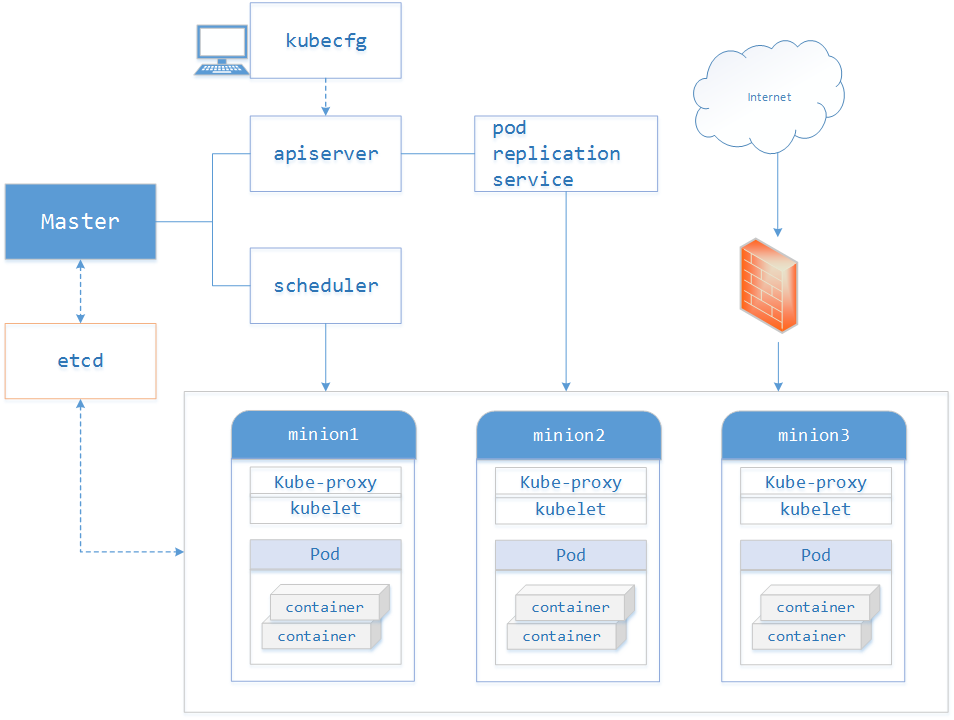

# kubernetes pods arrange

在Kubernetes中，能够被创建、调度和管理的最小部署单元是Pod，而非单个容器。

K8s有很多技术概念，同时对应很多API对象，最重要的也是最基础的是微服务Pod。Pod是在K8s集群中运行部署应用或服务的最小单元，它是可以支持多容器的。Pod的设计理念是支持多个容器在一个Pod中共享网络地址和文件系统，可以通过进程间通信和文件共享这种简单高效的方式组合完成服务。Pod对多容器的支持是K8s最基础的设计理念。比如你运行一个操作系统发行版的软件仓库，一个Nginx容器用来发布软件，另一个容器专门用来从源仓库做同步，这两个容器的镜像不太可能是一个团队开发的，但是他们一块儿工作才能提供一个微服务；这种情况下，不同的团队各自开发构建自己的容器镜像，在部署的时候组合成一个微服务对外提供服务。

Pod是K8s集群中所有业务类型的基础，可以看作运行在K8s集群中的小机器人，不同类型的业务就需要不同类型的小机器人去执行。目前K8s中的业务主要可以分为长期伺服型（long-running）、批处理型（batch）、节点后台支撑型（node-daemon）和有状态应用型（stateful application）；分别对应的小机器人控制器为Deployment、Job、DaemonSet和StatefulSet;

#### Kubernetes各组件介绍

* Pods

在Kubernetes系统中，调度的最小颗粒不是单纯的容器，而是抽象成一个Pod，Pod是一个可以被创建、销毁、调度、管理的最小的部署单元。把相关的一个或多个容器（Container）构成一个Pod，通常Pod里的容器运行相同的应用。
Pod包含的容器运行在同一个Minion(Host)上，看作一个统一管理单元，共享相同的volumes和network namespace/IP和Port空间。

* Services

Services也是Kubernetes的基本操作单元，是真实应用服务的抽象，每一个服务后面都有很多对应的容器来支持，通过Proxy的port和服务selector决定服务请求传递给后端提供服务的容器，对外表现为一个单一访问地址，外部不需要了解后端如何运行，这给扩展或维护后端带来很大的好处。

* Replication Controller

Replication Controller，理解成更复杂形式的pods，它确保任何时候Kubernetes集群中有指定数量的pod副本(replicas)在运行，如果少于指定数量的pod副本(replicas)，Replication Controller会启动新的Container，反之会杀死多余的以保证数量不变。Replication Controller使用预先定义的pod模板创建pods，一旦创建成功，pod 模板和创建的pods没有任何关联，可以修改 pod 模板而不会对已创建pods有任何影响，也可以直接更新通过Replication Controller创建的pods。对于利用 pod 模板创建的pods，Replication Controller根据 label selector 来关联，通过修改pods的label可以删除对应的pods。

Replication Controller主要有如下用法：

1. Rescheduling

Replication Controller会确保Kubernetes集群中指定的pod副本(replicas)在运行， 即使在节点出错时。

2. Scaling

通过修改Replication Controller的副本(replicas)数量来水平扩展或者缩小运行的pods。

3. Rolling updates

Replication Controller的设计原则使得可以一个一个地替换pods来滚动更新（rolling updates）服务。

4. Multiple release tracks
如果需要在系统中运行multiple release的服务，Replication Controller使用labels来区分multiple release tracks

* Labels

service和replicationController只是建立在pod之上的抽象，最终是要作用于pod的,但是它们如何跟pod联系起来呢？

这就引入了label的概念：label其实很好理解，就是为pod加上可用于搜索或关联的一组key/value标签，而service和replicationController正是通过label来与pod关联的。
为了将访问Service的请求转发给后端提供服务的多个容器，正是通过标识容器的labels来选择正确的容器；Replication Controller也使用labels来管理通过 pod 模板创建的一组容器，这样Replication Controller可以更加容易，方便地管理多个容器。

如下图所示，有三个pod都有label为"app=backend"，创建service和replicationController时可以指定同样的label:"app=backend"，再通过label selector机制，就将它们与这三个pod关联起来了。

例如，当有其他frontend pod访问该service时，自动会转发到其中的一个backend pod。

#### Kubenetes整体框架

Kubenetes整体框架如下图，主要包括kubecfg、Master API Server、Kubelet、Minion(Host)以及Proxy。

1. Master

Master定义了Kubernetes 集群Master/API Server的主要声明，包括Pod Registry、Controller Registry、Service Registry、Endpoint Registry、Minion Registry、Binding Registry、RESTStorage以及Client, 是client(Kubecfg)调用Kubernetes API，管理Kubernetes主要构件Pods、Services、Minions、容器的入口。
Master由API Server、Scheduler以及Registry等组成。从下图可知Master的工作流主要分以下步骤：

* Kubecfg将特定的请求，比如创建Pod，发送给Kubernetes Client。
* Kubernetes Client将请求发送给API server。
* API Server根据请求的类型，比如创建Pod时storage类型是pods，然后依此选择何种REST Storage API对请求作出处理。
* REST Storage API对的请求作相应的处理。
* 将处理的结果存入高可用键值存储系统Etcd中。
* 在API Server响应Kubecfg的请求后，Scheduler会根据Kubernetes Client获取集群中运行Pod及Minion信息。
* 依据从Kubernetes Client获取的信息，Scheduler将未分发的Pod分发到可用的Minion节点上。

Master的主要构件的详细介绍。

* Minion Registry

Minion Registry负责跟踪Kubernetes 集群中有多少Minion(Host)。Kubernetes封装Minion Registry成实现Kubernetes API Server的RESTful API接口REST，通过这些API，我们可以对Minion Registry做Create、Get、List、Delete操作，由于Minon只能被创建或删除，所以不支持Update操作，并把Minion的相关配置信息存储到etcd。除此之外，Scheduler算法根据Minion的资源容量来确定是否将新建Pod分发到该Minion节点。

* Pod Registry

Pod Registry负责跟踪Kubernetes集群中有多少Pod在运行，以及这些Pod跟Minion是如何的映射关系。将Pod Registry和Cloud Provider信息及其他相关信息封装成实现Kubernetes API Server的RESTful API接口REST。通过这些API，我们可以对Pod进行Create、Get、List、Update、Delete操作，并将Pod的信息存储到etcd中，而且可以通过Watch接口监视Pod的变化情况，比如一个Pod被新建、删除或者更新。

* Service Registry

Service Registry负责跟踪Kubernetes集群中运行的所有服务。根据提供的Cloud Provider及Minion Registry信息把Service Registry封装成实现Kubernetes API Server需要的RESTful API接口REST。利用这些接口，我们可以对Service进行Create、Get、List、Update、Delete操作，以及监视Service变化情况的watch操作，并把Service信息存储到etcd。

* Controller Registry

Controller Registry负责跟踪Kubernetes集群中所有的Replication Controller，Replication Controller维护着指定数量的pod 副本(replicas)拷贝，如果其中的一个容器死掉，Replication Controller会自动启动一个新的容器，如果死掉的容器恢复，其会杀死多出的容器以保证指定的拷贝不变。通过封装Controller Registry为实现Kubernetes API Server的RESTful API接口REST， 利用这些接口，我们可以对Replication Controller进行Create、Get、List、Update、Delete操作，以及监视Replication Controller变化情况的watch操作，并把Replication Controller信息存储到etcd。

* Endpoints Registry

Endpoints Registry负责收集Service的endpoint，比如Name："mysql"，Endpoints: ["10.10.1.1:1909"，"10.10.2.2:8834"]，同Pod Registry，Controller Registry也实现了Kubernetes API Server的RESTful API接口，可以做Create、Get、List、Update、Delete以及watch操作。

* Binding Registry

Binding包括一个需要绑定Pod的ID和Pod被绑定的Host，Scheduler写Binding Registry后，需绑定的Pod被绑定到一个host。Binding Registry也实现了Kubernetes API Server的RESTful API接口，但Binding Registry是一个write-only对象，所有只有Create操作可以使用， 否则会引起错误。

* Scheduler

Scheduler收集和分析当前Kubernetes集群中所有Minion节点的资源(内存、CPU)负载情况，然后依此分发新建的Pod到Kubernetes集群中可用的节点。由于一旦Minion节点的资源被分配给Pod，那这些资源就不能再分配给其他Pod， 除非这些Pod被删除或者退出， 因此，Kubernetes需要分析集群中所有Minion的资源使用情况，保证分发的工作负载不会超出当前该Minion节点的可用的资源范围。具体来说，Scheduler做以下工作：

1. 实时监测Kubernetes集群中未分发的Pod。
2. 实时监测Kubernetes集群中所有运行的Pod，Scheduler需要根据这些Pod的资源状况安全地将未分发的Pod分发到指定的Minion节点上。
3. Scheduler也监测Minion节点信息，由于会频繁查找Minion节点，Scheduler会缓存一份最新的信息在本地。
4. Scheduler在分发Pod到指定的Minion节点后，会把Pod相关的信息Binding写回API Server。

#### kubelet

Kubelet是Kubernetes集群中每个Minion和Master API Server的连接点，Kubelet运行在每个Minion上，是Master API Server和Minion之间的桥梁，接收Master API Server分配给它的commands和work，与持久性键值存储etcd、file、server和http进行交互，读取配置信息。Kubelet的主要工作是管理Pod和容器的生命周期，其包括Docker Client、Root Directory、Pod Workers、Etcd Client、Cadvisor Client以及Health Checker组件，具体工作如下：

1. 通过Worker给Pod异步运行特定的Action
2. 设置容器的环境变量
3. 给容器绑定Volume
4. 给容器绑定Port
5. 根据指定的Pod运行一个单一容器
6. kill杀死容器
7. 给指定的Pod创建network 容器
8. 删除Pod的所有容器
9. 同步Pod的状态
10. 从cAdvisor获取container info、 pod info、 root info、 machine info
11. 检测Pod的容器健康状态信息
12. 在容器中运行命令。

#### Proxy

Proxy是为了解决外部网络能够访问跨机器集群中容器提供的应用服务而设计的，运行在每个Minion上。Proxy提供TCP/UDP sockets的proxy，每创建一种Service，Proxy主要从etcd获取Services和Endpoints的配置信息（也可以从file获取），然后根据配置信息在Minion上启动一个Proxy的进程并监听相应的服务端口，当外部请求发生时，Proxy会根据Load Balancer将请求分发到后端正确的容器处理。

所以Proxy不但解决了同一主宿机相同服务端口冲突的问题，还提供了Service转发服务端口对外提供服务的能力，Proxy后端使用了随机、轮询负载均衡算法。

License
This is free software distributed under the terms of the MIT license
